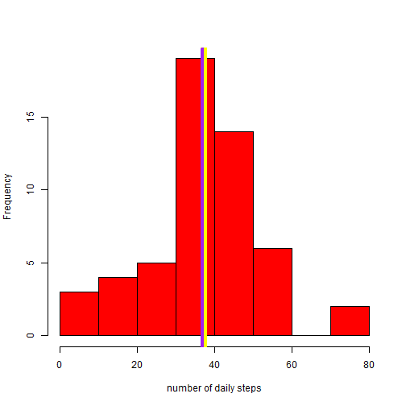
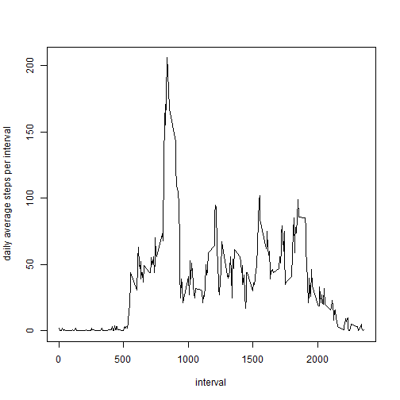
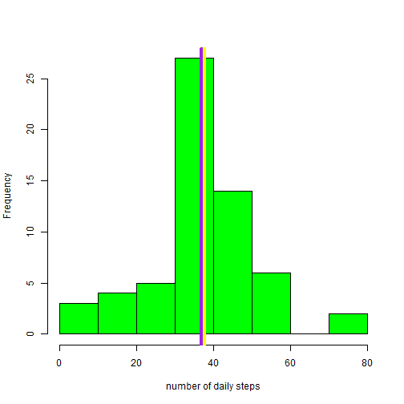
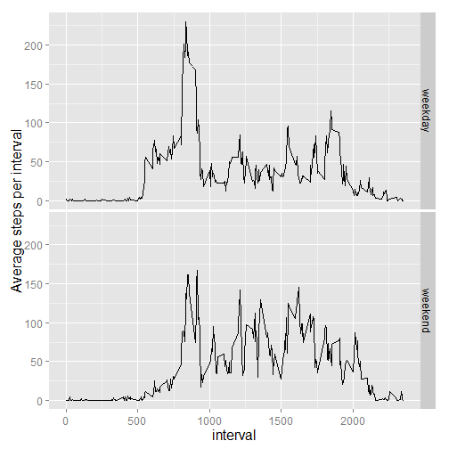

Load necessary packages:

```r
library(dplyr)
library(ggplot2)
library(knitr)
knitr::opts_chunk$set(echo=TRUE)
```


#### 1) Loading and processing the data

```r
# Load the data

rawdata = read.csv("activity.csv")
```


#### 2) What is mean total number of steps taken per day?


```r
# Get rid of missing values:

rawdata_clean = rawdata[complete.cases(rawdata),]

# Calculate the total number and daily average of steps taken per day:

rawdata_a = 
  rawdata_clean %>%
  group_by(date) %>%
  summarize(avg_daily_steps = round(mean(steps)),
            total_daily_steps = sum(steps))

# Create a histogram:

hist(rawdata_a$avg_daily_steps, col="red", xlab = "number of daily steps", main="")
  abline(v=mean(rawdata_a$avg_daily_steps), col = "yellow", lwd = 8)
  abline(v=median(rawdata_a$avg_daily_steps), col = "purple", lwd = 4)
```

 

```r
# Calculate the mean and median of the total number of steps taken per day

daymean = round(mean(rawdata_a$avg_daily_steps), digits = 2)
daymedian = median(rawdata_a$avg_daily_steps)
```

The average steps taken per day is 37.34 (yellow line in histogram).  
The median number of steps taken per day is 37 (purple line in histogram).

#### 3) What is the average daily activity pattern? 


```r
# Create line plot

rawdata_b = 
  rawdata_clean %>%
  group_by(interval) %>%
  summarise(avg_steps_interval = round(mean(steps)))


plot(rawdata_b$interval, rawdata_b$avg_steps_interval, type ="l", xlab= "interval", ylab="daily average steps per interval")
```

 

```r
# 5-minute interval, on average across all the days in the dataset, that contains the maximum number of steps

max = max(rawdata_b$avg_steps_interval)
int = filter(rawdata_b, avg_steps_interval == 206)
int1 = int[1]
```

The maximum number of steps on average for a given 5-minute interval is 206, which corresponds to the 835 interval.

#### 4) Inputing missing values

```r
miss_val = sum(is.na(rawdata$steps))
```

The total number of missing values in the dataset is 2304.


```r
# create an interval vector to loop through

interval = unique(rawdata$interval)

# create a new dataset

fulldata = rawdata

# replace NAs for the average steps corresponding to that 5-minute interval in the new dataset

for (i in interval){
  fulldata$steps[which(is.na(fulldata$step) & fulldata$interval==i)] <- mean(fulldata[fulldata$interval == i, c("steps")], na.rm = TRUE)
}

# recalculate the number of steps taken each day

fulldata_a = 
  fulldata %>%
  group_by(date) %>%
  summarize(avg_daily_steps = round(mean(steps)))

# create corresponding histogram

hist(fulldata_a$avg_daily_steps, col="green", xlab = "number of daily steps", main="")
  abline(v=mean(fulldata_a$avg_daily_steps), col = "yellow", lwd = 8)
  abline(v=median(fulldata_a$avg_daily_steps), col = "purple", lwd = 4)
```

 

```r
newdaymean = round(mean(fulldata_a$avg_daily_steps), digits = 2)
newdaymedian = median(fulldata_a$avg_daily_steps)
```

The corrected average of steps taken per day is 37.3 (yellow line in histogram).  
The corrected median number of steps taken per day is 37 (purple line in histogram).  
Imputing missing data did not have a significant effect on these parameters, the numbers are either the same or very similar to those calculated above.

#### 5) Are there differences in activity patterns between weekdays and weekends?


```r
# create new column with corresponding day names

fulldata2 = mutate(fulldata, days = weekdays(as.Date(fulldata$date)))

# classify days as weekday/weekend

weekday = c("Monday", "Tuesday", "Wednesday", "Thursday", "Friday")
weekend = c("Saturday", "Sunday")

fulldata2$days[which(fulldata2$days %in% weekday)] <- "weekday"
fulldata2$days[which(fulldata2$days %in% weekend)] <- "weekend"

# create line plot

fulldata2_b = 
  fulldata2 %>%
  group_by(interval, days) %>%
  summarise(avg_steps_interval = round(mean(steps)))


ggplot(aes(x=interval, y=avg_steps_interval), data=fulldata2_b) +
  geom_line() +
  labs(y = "Average steps per interval") +
  theme(axis.title.x = element_text(size=16),
          axis.text.x  = element_text(size=12),
          axis.title.y = element_text(size=16),
          axis.text.y = element_text(size=12),
          strip.text.x = element_text(size=12),
          strip.text.y = element_text(size=12)) +
  facet_grid(days~.)
```

 

There are some differences in patterns of weekdays vs weekends: during weekdays there's a peak of activity corresponding to late morning hours, while during the weekends the activity is more evenly distributed along the day. Also, activity starts later on weekends... as it should!
